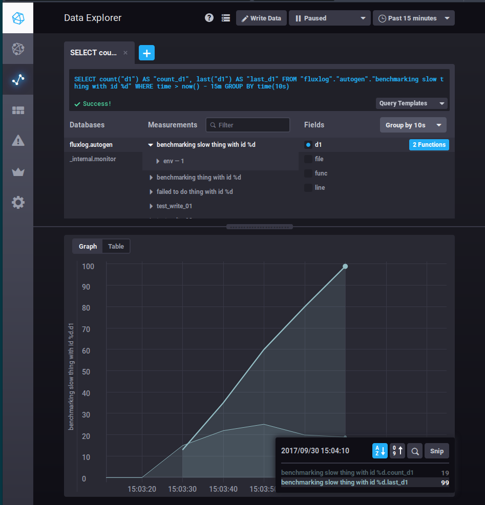

# Fluxlog

Fluxlog takes the oppinionated approach that conventional logging is a method of telling your control systems (systemd, devops team, etc) how your software is behaving, not for logging process events that are expected to occur. Instead of falling into the common mistake of logging expected events (like say a customer purchase or email being sent out) Fluxlog will store a measurement in a timeseries database with the time the event occured and any other relevent metadata. This allows for rapid insights into what your software is doing and separate from the normal logs that now are solely for communicating system level health and information.

## Usage

At it's simplest this is just a wrapper to easily write data points to influxdb and you can still use it for that alone, however because of the intended use case this will only ever write over HTTP sending one point at a time which may not fit all use cases:

```go
package main
import (
  "github.com/nekroze/fluxlog"
)

func main() {
  fluxlog.SetAddress("http://localhost:8086")
  fluxlog.Write("mymeasurement", map[string]interface{}{"value": 42}, map[string]string{"locationtag": "earth"})
}
```

This is perfect for the intended use of logging single events occuring in your code where you might have logged out to a file or console in the past.

As a convinience fluxlog as a `Writef` function that is similar to golang standard logging functions such that you could start to convert log lines to use fluxlog:

```go
package main
import (
  "github.com/nekroze/fluxlog"
)

func main() {
  fluxlog.SetAddress("http://localhost:8086")
  fluxlog.Writef("customer %d failed to do important thing", 42)
}
```

The above code would write to a measurement that is the unformatted string in the first parameter and it would have a single value attached to the measurent called `d1` (the first `%d` format label) with a value of `42`. It does this by automatically converting format strings into a map of values to be written to the database, using the unformatted string as a kind of signature of the event/error.

For extra information about the events your code triggers, fluxlog can add fields from go runtime data such as the file, function name, and line number of the caller to either `fluxlog.Write` or `fluxlog.Writef` however this functionality is disable by default.

```go
package main
import (
  "github.com/nekroze/fluxlog"
)

func main() {
  fluxlog.SetAddress("http://localhost:8086")
  fluxlog.SaveMetadata(true)
  fluxlog.Writef("customer %d failed to do important thing", 42)
}
```

While this is very similar to the last example it has enabled saving metadata. Now the saved data point will have the `d1` field with a value of `42` but also fields `file`, `func`, and `line` the last of which will equal `10` as that is the line number calling `fluxlog.Writef`.

## Tests

Fluxlog attempts to provide a complete test suite including benchmarks and coverage reports and a easy to use tool chain. At minimum you need docker-compose installed but after that even having Go installed is optional.

There is a convinient test script that will make sure everything is set up to run the entire test suite and report on it. This should be the single entrypoint for testing and ci testing.

```bash
 $ ./test.sh
```

To run the benchmark suites over a longer period of time to give you an idea of the kind of data fluxlog produces and inspect it using a dashboard like chronograf or grafana, simple define the environment variable `FLUXLOG_TEST_ACTION` with a value of `DEMO` which will enable a longer test suite run that takes several minutes and can demonstrate live data ingestion.

Here you can see the demo run output in chronograf graphing how many events occurred and the latest value of d1 at that time:

